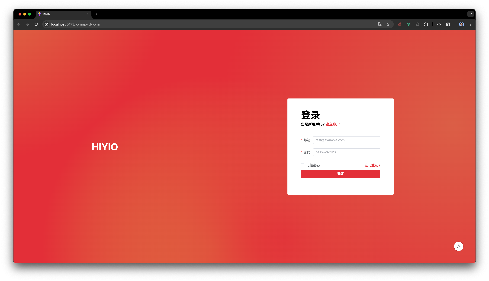

# Simple Test

## 设计思路
首先确定网站的主题色为红色(#E32F38)，然后登录页面设置动态背景色为主题色和主题类比色。


使用 ```Element Plus``` 组件库，功能齐全带表单认证。

开发了登录页面和登录成功页面，其中登录页面包含邮箱密码登录组件、注册组件、重置密码组件，通过路由切换组件并添加过渡效果。

使用 ```unplugin-vue-router``` 基于文件的路由的库，这样就不用维护一个路由数组，只需要在 ```src/pages``` 目录下添加 ```.vue``` 文件即可。


使用 ``` useDark|VueUse ``` 来实现动态切换暗黑模式。

使用 ``` axios ``` 封装一个自定义的请求类，每次请求添加防抖，并统一处理错误。

使用 ``` Mock.js ``` 来拦截请求，并模拟数据返回。

## 自我评价

### 技术栈
- 熟练使用 JavaScript 理解原型、闭包、异步等概念
- 熟悉 HTML5、CSS3、ES6，熟悉响应式布局、函数式编程，了解 TypeScript
- 熟悉 Vue3及其全家桶 Pinia、Vue-Router、Axios、Element Plus 等
- 熟悉使用 Electron 开发跨平台桌面应用和使用 Node.js、MySQL 搭建后台系统，了解 Vite 打包

### 项目亮点
还算优雅的页面设计，良好的命名与项目目录结构组织，选用前沿新颖的技术。

### 优化思路
随着项目越来越大，页面越来越多，维护路由数组成为一个比较棘手的问题，所以使用 ```unplugin-vue-router``` 基于文件路由的库来优化。

封装一个请求类，并统一做错误处理和防抖，降低后续使用的心智负担，和服务端资源的消耗。

使用媒体查询来适配桌面端、平板的访问，使用怪异盒子来适配移动端。

## 问题回答
- **求职等级**： 初级
- **期望薪资**： 7K
- **期望的工作形式**： 都可以
- **是否在常州居住**： 是的，武进区
- **是否需要提供住宿**： 不需要
- **最快到岗时间**： 随时
- **你在工作中碰到的最大的困难是什么，你是如何解决的**：
  以前被要求完成一个桌面端软件的开发，但是我没有桌面端软件的开发经验，初步设想使用 ```PWA```，一番搜索之后发现了```Electron``` 框架，一边读文档一边摸着石头过河，虽然磕磕绊绊还没赶上deadline，但最终还是交付了软件。
- **你未来3年的规划是怎样的**：
  持续学习，学好英语，不给自己设限，扩大技术的广度。
